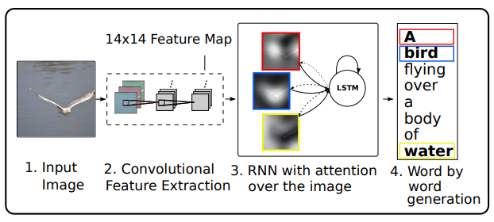

# Show, Attend and Tell (Keras) [WIP]
Keras implementation of the paper [Show, Attend and Tell: Neural Image Caption Generation with Visual Attention](http://arxiv.org/abs/1502.03044) which introduces an attention based image caption generator. The model changes its attention to the relevant part of the image while it generates each word.

This figure form the original paper gives a short explanation of the network's structure.

This project depends on the [Keras Utility & Layer Collection (kulc)](https://github.com/FlashTek/keras-layer-collection), which implements many useful layers and utility functions for attention based models.

